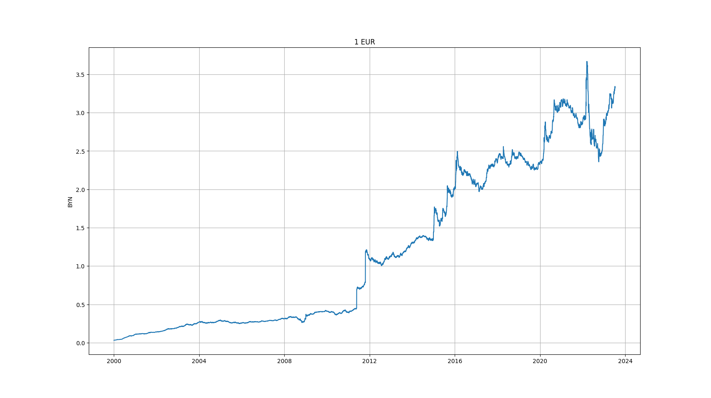
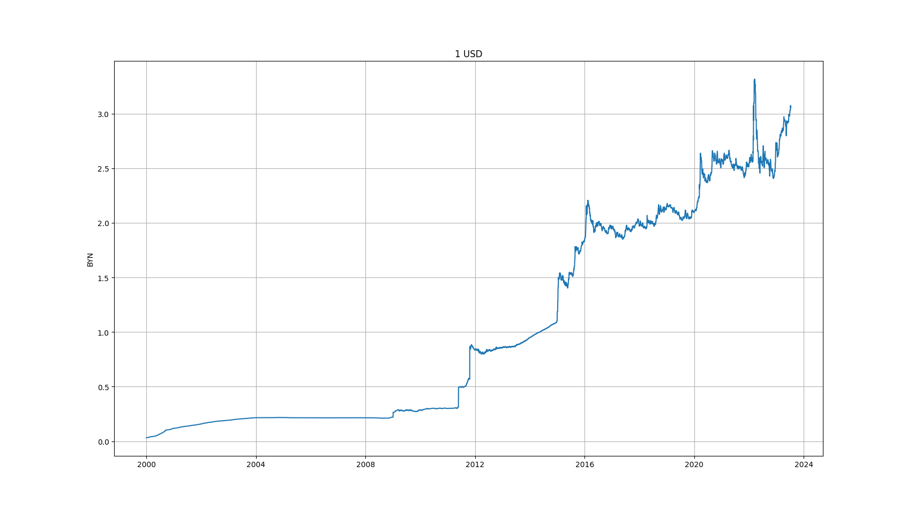

# NBRBCurrencies
Download official currencies rates from NBRB (used [API](https://www.nbrb.by/apihelp/exrates))

Use command

    DownloadNBRBdata.py -EUR
    
or

    DownloadNBRBdata.py -USD
    
to get EUR/USD rates from NBRB.

The data will save to files EUR-2000-2023.json/USD-2000-2023.json:

    ...
    {
        "Cur_ID": 431,
        "Date": "2023-07-05T00:00:00",
        "Cur_OfficialRate": 3.0352
    },
    {
        "Cur_ID": 431,
        "Date": "2023-07-06T00:00:00",
        "Cur_OfficialRate": 3.0434
    }
    ...

To build graphs use command

    ShowCurrencyRates.py

### Examples (2000-2023):
 
